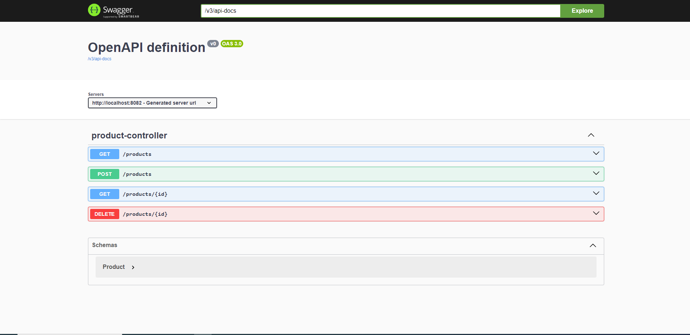

<h1>Gestion des Produits stockés avec Cassandra</h1>
<h2>Description</h2>

Il s'agit d'une application Spring Boot qui réalise des opérations CRUD (Créer, Lire, Mettre à jour, Supprimer) pour gérer des produits stockés dans une base de données Apache Cassandra.

<h2>Prérequis</h2>

<ul>
<li>Kit de développement Java (JDK) 11 ou supérieur</li> 
<li>Apache Maven</li>
<li>Apache Cassandra</li>
</ul>

<h2>Screenshot</h2>
